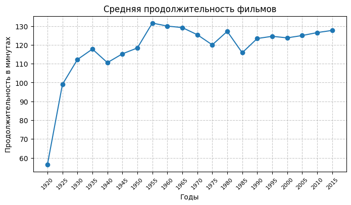
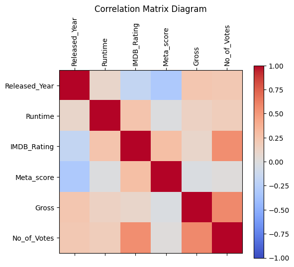
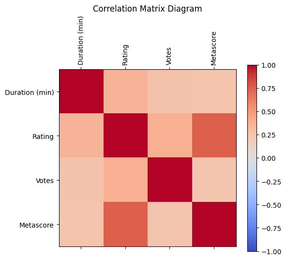
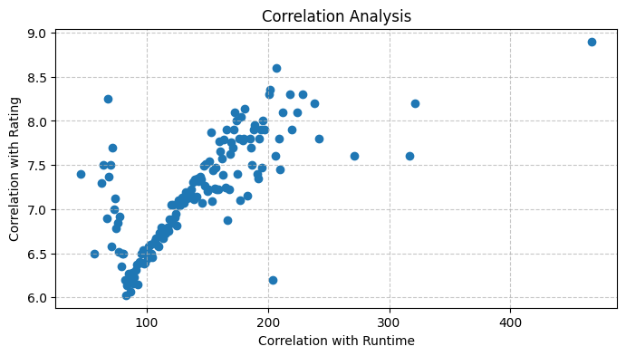
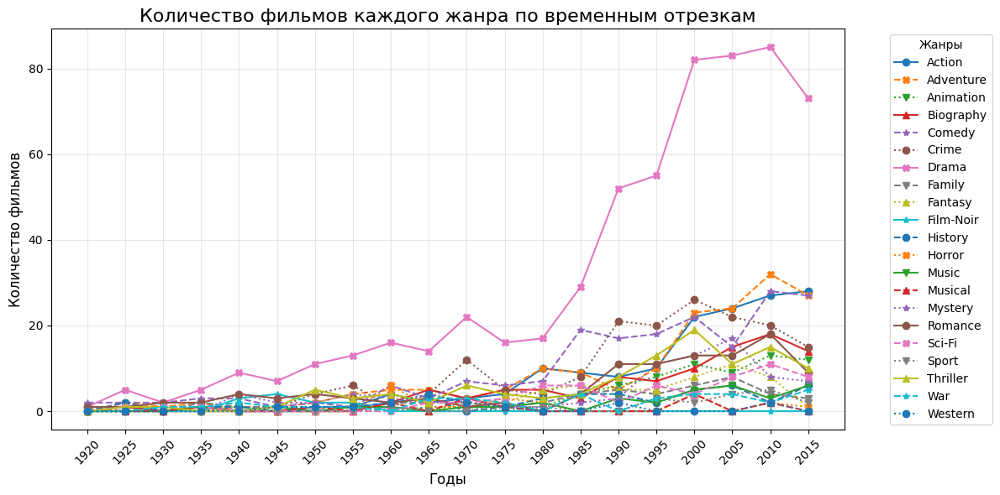
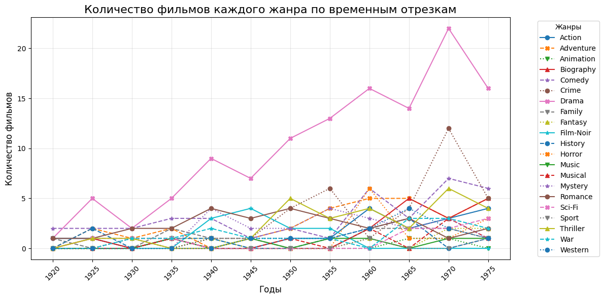
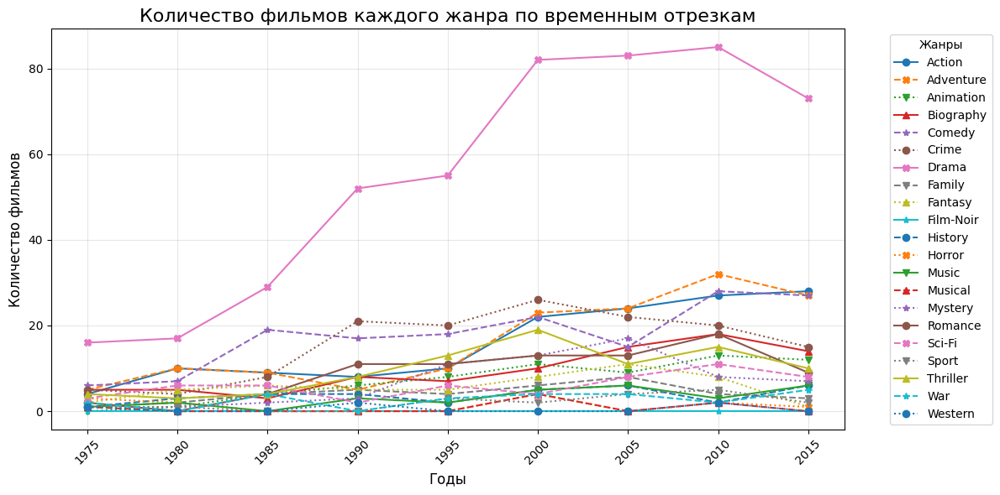
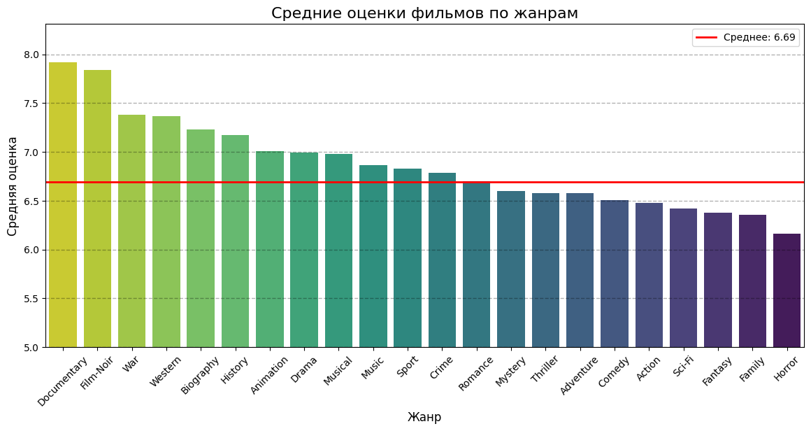
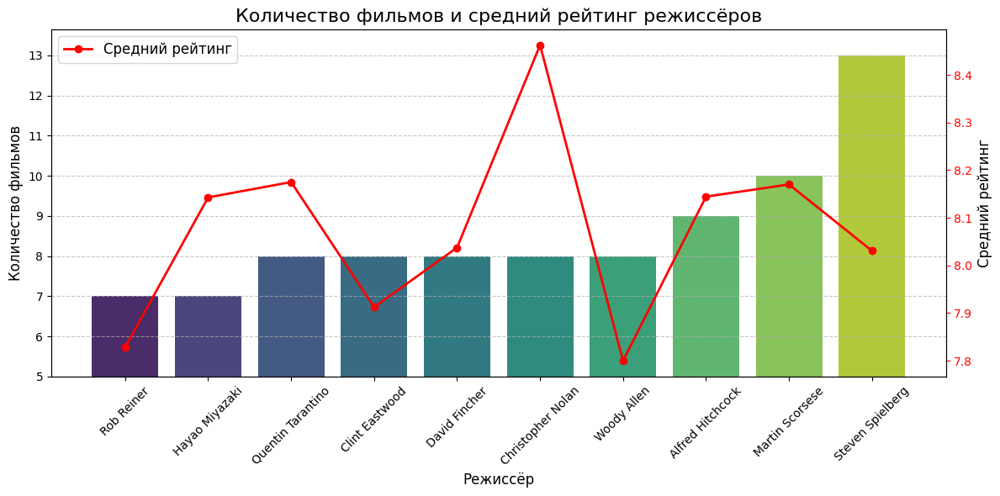
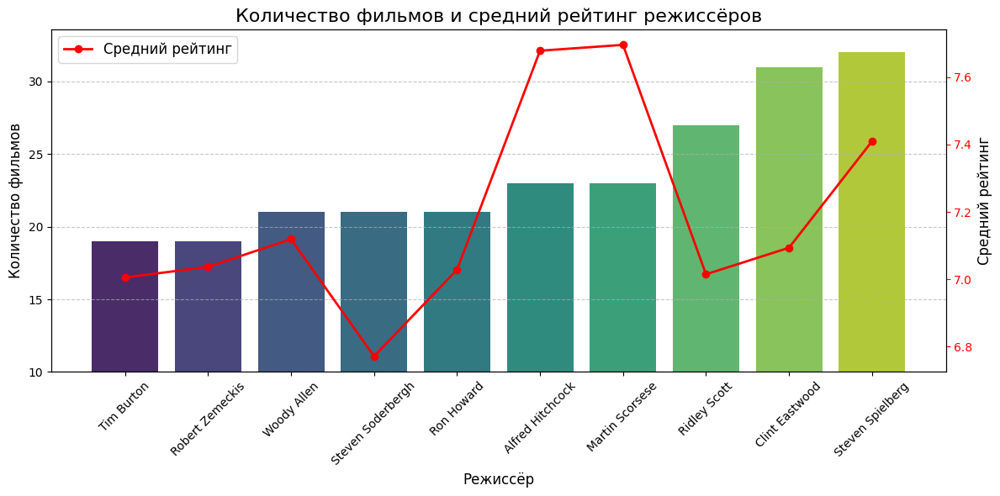

# Исследование базы данных фильмов с сайта IMDb

## Цели
1. Провести анализ изменений средней продолжительности фильмов в динамике по годам.
2. Исследовать взаимосвязи между продолжительностью фильмов, их рейтингами, кассовыми сборами и другими ключевыми характеристиками.
3. Проанализировать тренды популярности различных жанров в зависимости от временных периодов.
4. Вычислить средние оценки фильмов для каждого жанра и выявить наиболее высокооценённые жанры.
5. Определить наиболее успешных режиссёров на основе количества снятых фильмов и их среднего рейтинга.

## Происхождение наборов данных
Для анализа использовались два набора данных, предоставленные на платформе Kaggle, которая предлагает широкий выбор публичных материалов для анализа данных.

- [IMDb Dataset of Top 1000](https://www.kaggle.com/datasets/harshitshankhdhar/imdb-dataset-of-top-1000-movies-and-tv-shows): включает информацию о 1000 наиболее рейтинговых фильмов по версии IMDb.

- [IMDb Movies Dataset](https://www.kaggle.com/datasets/amanbarthwal/imdb-movies-data?resource=download): содержит данные о 10,000 фильмах базы данных IMDb.

## Описание данных
В рамках исследования использовались два датасета:

- Первый датасет представляет собой выборку из 1000 лучших фильмов IMDb. Его уникальной характеристикой является наличие столбца с кассовыми сборами фильмов, что позволяет дополнительно анализировать финансовую успешность картин.
- Второй датасет более масштабный, включает 10,000 фильмов и позволяет анализировать общие тенденции в кинематографе благодаря большему количеству наблюдений.

Оба набора данных содержат ключевые параметры фильмов, включая:

- Год выпуска,
- Рейтинг зрителей и критиков,
- Продолжительность фильмов,
- Жанры,
- Основные участники съёмочного процесса (режиссёры, актёры) и другие показатели.

## Преобразование данных 

Данные были структурированы и очищены для обеспечения корректности и полноты анализа.

**Чтение и обработка первого набора данных.**

В ходе работы с датасетом было обнаружено, что одна из записей имеет ошибочное значение в поле `Released_Year`.
```python
# Чтение данных из csv файла, удаление лишнего поля с ссылкой на постер фильма
DF_TOP_1000 = pd.read_csv('data/imdb_top_1000.csv').drop(columns=['Poster_Link'])

# Функция для исправления runtime
def runtime_fix(a):
    return a.replace(' min', '')

# Функция для удаления запятых
def deleting_comma(a):
    return str(a).replace(',', '')

df_movies = DF_TOP_1000.copy()

# Исправление ошибок датасета
df_movies['Released_Year'] = df_movies['Released_Year'].replace(to_replace='PG', value='1995')

# Преобразование полей датасета
df_movies.loc[:, 'Runtime'] = pd.to_numeric(df_movies['Runtime'].apply(runtime_fix))
df_movies.loc[:, 'Released_Year'] = pd.to_numeric(df_movies['Released_Year'])
df_movies.loc[:, 'IMDB_Rating'] = pd.to_numeric(df_movies['IMDB_Rating'])
df_movies.loc[:, 'Gross'] = df_movies['Gross'].apply(deleting_comma)

# Исключение записей с пустыми полями
df_movies = df_movies.drop(df_movies[df_movies.Gross == 'nan'].index).copy()

```

**Чтение и обработка второго набора данных**

После фильтрации записей по количеству оценок пользователей на сайте  (не менее 20000) в датасете осталось порядка 6000 строк.
```python
# Функция для удаления запятых из строк
def deleting_comma(a):
    return str(a).replace(',', '')

# Загрузка данных
DF_MOVIES = pd.read_csv('data/imdb-movies-dataset.csv').drop(columns=['Poster'])

# Удаление строк с пропущенными ключевыми полями
df_cleaned = DF_MOVIES.dropna(subset=['Year', 'Rating', 'Votes', 'Genre', 'Duration (min)']).copy()

# Преобразование столбцов Votes и Rating
df_cleaned.loc[:, 'Votes'] = pd.to_numeric(df_cleaned['Votes'].apply(deleting_comma))
df_cleaned.loc[:, 'Rating'] = pd.to_numeric(df_cleaned['Rating'].apply(deleting_comma))
df_cleaned.loc[:, 'Genre'] = df_cleaned['Genre']

# Фильтрация по порогу оценок
votes_threshold = 20000
df_cleaned = df_cleaned[df_cleaned['Votes'] >= votes_threshold].copy()

# Удаление дубликатов
df_cleaned = df_cleaned.drop_duplicates(subset=['Title', 'Year']).copy()

# Удаление фильмов с некорректной длительностью
df_cleaned = df_cleaned[df_cleaned['Duration (min)'] > 0].copy()
```

## Результаты исследования

**Анализ изменений средней продолжительности фильмов в динамике по годам**

Для анализа временных изменений средней продолжительности фильмов был использован первый датасет, поскольку второй содержал значительные ошибки в данных о годах выпуска фильмов.

С использованием библиотеки pandas были рассчитаны средние значения продолжительности фильмов, сгруппированные по пятилетним интервалам.



Как видно, на заре кинематографа средняя продолжительность фильмов состовляла от 60 до 100 минут. 
Начиная с 1950-ых годов, средняя длина кинокартин стабилизировалась в районе 2 часов. 

**Исследование взаимосвязи между продолжительностью фильмов, их рейтингами, кассовыми сборами и другими ключевыми характеристиками**

Для изучения взаимосвязей между различными параметрами фильмов, такими как продолжительность, рейтинги, кассовые сборы и количество голосов, была построена корреляционная матрица и тепловая карта. 

**Корреляционная матрица первого датасета**

|               |   Released_Year |    Runtime |   IMDB_Rating |   Meta_score |      Gross |   No_of_Votes |
|:--------------|----------------:|-----------:|--------------:|-------------:|-----------:|--------------:|
| Released_Year |       1         |  0.0948136 |    -0.174931  |   -0.30642   |  0.233178  |     0.211428  |
| Runtime       |       0.0948136 |  1         |     0.246756  |   -0.0122111 |  0.139671  |     0.173205  |
| IMDB_Rating   |      -0.174931  |  0.246756  |     1         |    0.28269   |  0.0959228 |     0.551261  |
| Meta_score    |      -0.30642   | -0.0122111 |     0.28269   |    1         | -0.030587  |     0.0103083 |
| Gross         |       0.233178  |  0.139671  |     0.0959228 |   -0.030587  |  1         |     0.574393  |
| No_of_Votes   |       0.211428  |  0.173205  |     0.551261  |    0.0103083 |  0.574393  |     1         |


**Тепловая карта первого датасета**



- Существует сильная положительная корреляция между количеством голосов и кассовыми сборами.
- Год выпуска фильмов имеет умеренную отрицательную корреляцию с оценками критиков, что может указывать на снижение качества фильмов с течением времени.
- Критические оценки практически не влияют на кассовые сборы.

**Корреляционная матрица второго датасета**

|                |   Duration (min) |   Rating |    Votes |   Metascore |
|:---------------|-----------------:|---------:|---------:|------------:|
| Duration (min) |         1        | 0.356468 | 0.262574 |    0.249546 |
| Rating         |         0.356468 | 1        | 0.381528 |    0.74771  |
| Votes          |         0.262574 | 0.381528 | 1        |    0.240361 |
| Metascore      |         0.249546 | 0.74771  | 0.240361 |    1        |


**Тепловая карта второго датасета**



Для второго датасета наблюдается более выраженная корреляция между оценками зрителей и критиков.

Отдельно исследуем зависимость между продолжительностью фильма и его оценкой от зрителей.



Исследование зависимости продолжительности фильма от оценки зрителей выявило нелинейную зависимость в форме буквы "V". Фильмы с длительностью 80–90 минут в среднем получают более низкие оценки. 

**Анализ трендов популярности различных жанров в зависимости от временных периодов**

Используя первый датасет, была построена визуализация изменения популярности жанров по интервалам в 5 лет.



Жанр "драма" лидирует по числу фильмов на протяжении всего периода наблюдений.

**Анализ временного интервала 1920–1980 гг.**



Можно сделать нескольеко наблюдений:
- Жанр "нуар" был актуален с 1935 по 1960 гг.
- Популярность "криминала" достигла пика в 1975–1980 гг.
- Помимо "драмы", в этот период пользовались спросом криминальные фильмы, триллеры и комедии.

**Анализ временного интервала 1975–2020 гг.**



В последние десятилетия возросла популярность жанров "приключения", "экшн" и "комедия".

**Вычислние средних оценок фильмов для каждого жанра**

Для анализа средних оценок фильмов каждого жанра использовался второй, более обширный датасет.



На основании графика можно сделать следующие выводы:
- Фильмы жанров нуар, вестерн, документальный и военный получают самые высокие средние оценки.
- Криминальные и романтические фильмы находятся в средней части рейтинга.
- Хорроры и фэнтези, напротив, демонстрируют самые низкие средние оценки.

**Определение наиболее успешных режиссёров**

Для выявления наиболее успешных режиссёров были проанализированы оба датасета. Критериями оценки стали количество снятых фильмов и их средний рейтинг.

**График первого датасета**


В пятёрку лидеров вошли:
1. Стивен Спилберг
2. Мартин Скорсезе
3. Альфред Хичкок
4. Вуди Аллен
5. Кристофер Нолан
Эти режиссёры чаще всего попадали в список 1000 лучших фильмов IMDb. Наибольшую среднюю оценку среди них имеет Кристофер Нолан.

**График второго датасета**


Распределение лидеров немного изменилось:
1. Стивен Спилберг сохраняет первое место.
2. Клинт Иствуд
3. Ридли Скотт
4. Мартин Скорсезе
5. Альфред Хичкок

В рамках этого анализа наивысший средний рейтинг принадлежит Мартину Скорсезе.


## Заключение

В рамках данного исследования был проведен подробный анализ двух датасетов, содержащих информацию о фильмах с IMDb. 
Целью работы было выявление ключевых закономерностей, трендов и особенностей кинематографа на основе представленных данных.

**Основные результаты:**
1. ***Средняя продолжительность фильмов:***

- На заре кинематографа фильмы имели продолжительность от 60 до 100 минут.
- Начиная с 50-х годов, средняя продолжительность стабилизировалась на уровне двух часов.

2. ***Взаимосвязи между параметрами фильмов:***

- Заметная положительная корреляция выявлена между числом зрительских оценок и кассовыми сборами, что подтверждает взаимосвязь популярности фильма и его коммерческого успеха.
- Средний рейтинг фильмов и оценки критиков слабо связаны с кассовыми сборами, что говорит о том, что высокое качество не всегда гарантирует коммерческий успех.
- Установлена нелинейная зависимость между продолжительностью фильма и его рейтингом. Киноленты длительностью 80–90 минут в среднем получают более низкие оценки.

3. ***Тренды популярности жанров:***

- В течение всего периода доминирующим жанром оставалась драма.
- В разные временные периоды набирали популярность такие жанры, как нуар (1935–1960 гг.), криминал (1975–1980 гг.), а также приключения, экшн и комедии (с конца XX века до настоящего времени).

4. ***Средние оценки по жанрам:***

- Наивысшие оценки, как правило, получают фильмы жанров "нуар", "вестерн", "документальный" и "военный".
- Самые низкие оценки характерны для фильмов жанров "хоррор" и "фэнтези".

5. ***Анализ успешных режиссеров:***

- Среди режиссеров выделяются Стивен Спилберг, Мартин Скорсезе, Альфред Хичкок, Вуди Аллен и Кристофер Нолан.
- Спилберг возглавляет список по количеству снятых фильмов, тогда как наивысший средний рейтинг принадлежит Нолану (по первому датасету) и Скорсезе (по второму).